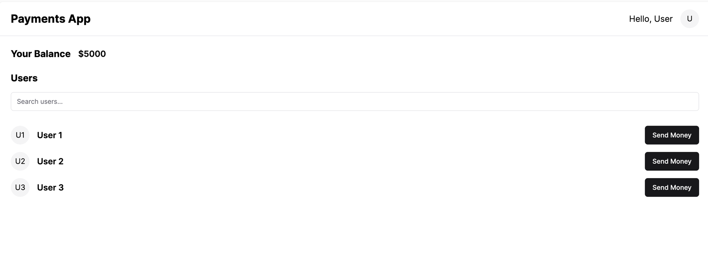
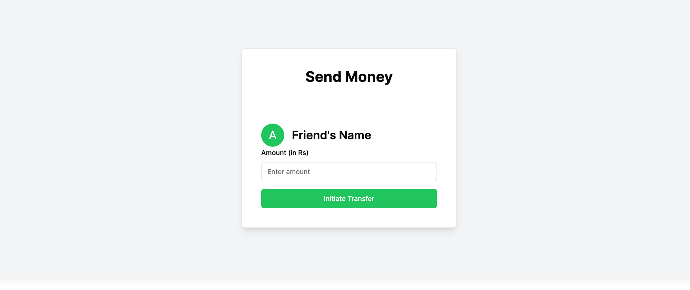
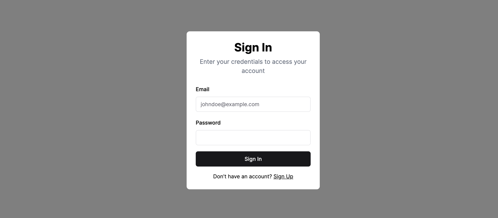
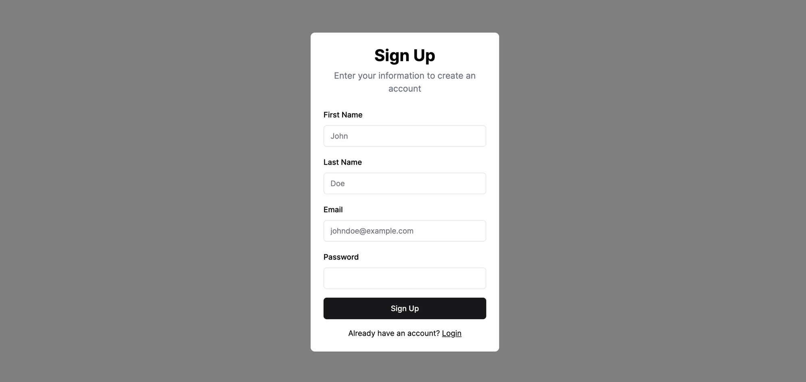

## Build a basic version of PayTM

## File Structure

### Backend

- **backend/routes/index.js**
  - Handles routing requests.

- **backend/user.js**
  - Manages server requests (GET, POST, PUT) for:
    - Signup and Signin
    - Retrieving all user details (for money transfer)
    - Updating user details

- **middleware.js**
  - Contains authorization logic for signing incoming passwords.
  - *Note: In a real-world scenario, data should be hashed before storage in a database.*

- **db.js**
  - Defines database table schemas and contains logic for database connection.

- **config.js**
  - Stores the JWT_SECRET.
  - *Note: In a real-world scenario, confidential information such as JWT_SECRET and database URLs should be stored in a .env file.*
   
   
   

</img>
 
 
 
</img>
 
 
 
</img>
 
 
 
</img>